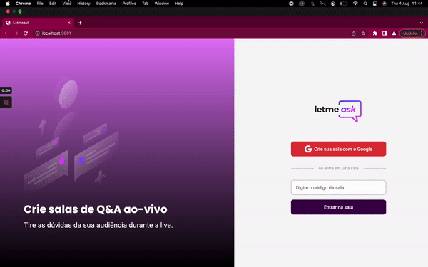
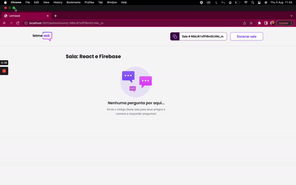
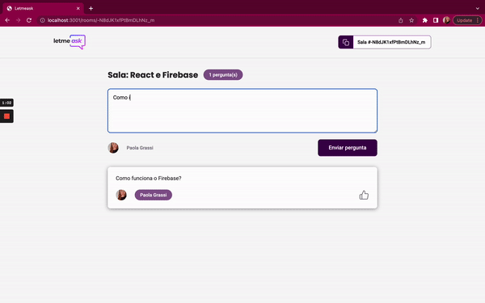
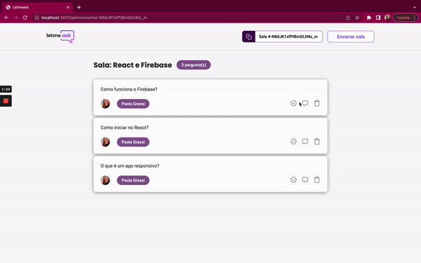

# About the project
This project is a Question and Answer room to use in real time during your lives. I made the Letmeask during a knowledge trail with RocketSeat, the NLW #06.   
:rocket: It was build with React, TypeScript, Sass, HTML and Firebase API. 

# Getting Started with Create React App

This project was bootstrapped with [Create React App](https://github.com/facebook/create-react-app).

## Available Scripts

In the project directory, you can run:

### `npm start`

Runs the app in the development mode.\
Open [http://localhost:3000](http://localhost:3000) to view it in the browser.

The page will reload if you make edits.\
You will also see any lint errors in the console.

